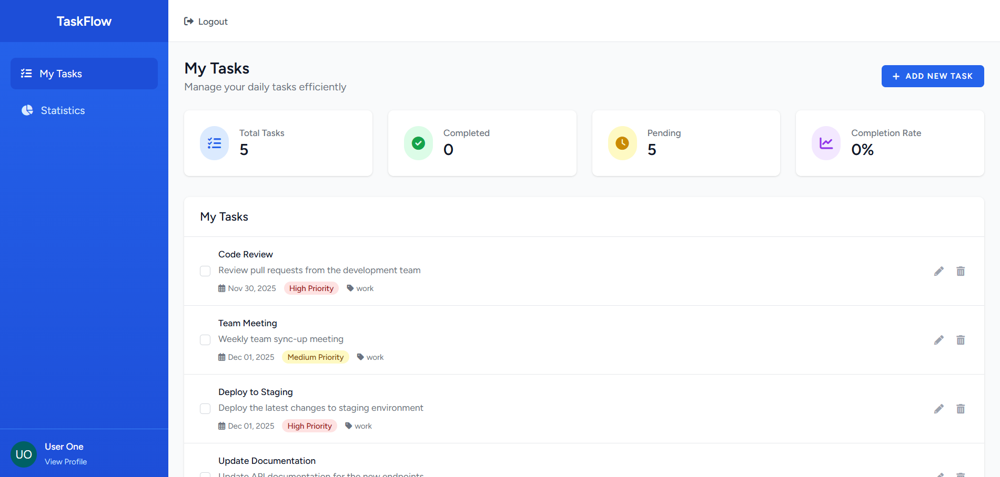

# 📝 TaskFlow App


**TaskFlow** adalah aplikasi manajemen tugas berbasis web yang dirancang untuk meningkatkan produktivitas harian. Aplikasi ini membantu pengguna mengorganisir pekerjaan, memantau progress melalui statistik, dan mengelompokkan tugas berdasarkan prioritas atau kategori.

---

## 📸 Screenshots


*Halaman Dashboard TaskFlow - Menampilkan daftar tugas dan statistik produktivitas*


---

## ✨ Fitur Utama

Berdasarkan struktur kode saat ini, aplikasi ini memiliki fitur:

-   **✅ Task Management (CRUD):** Tambah, edit, hapus, dan tandai tugas sebagai "Selesai".
-   **📊 Productivity Statistics:** Dashboard visual untuk melihat performa penyelesaian tugas.
-   **📂 Smart Categorization:** Pengelompokan tugas (enum) untuk manajemen yang lebih rapi.
-   **🔐 Secure Authentication:** Sistem Login dan Register yang aman.
-   **🌍 Multi-Language Support:** Mendukung Bahasa Indonesia dan Inggris (i18n).
-   **📱 Responsive Design:** Tampilan rapi di desktop maupun mobile (menggunakan Blade Templates).

---

## 🛠️ Teknologi yang Digunakan

-   **Framework:** Laravel 10/11 (PHP)
-   **Database:** MySQL
-   **Frontend:** Blade Templates, Bootstrap/Tailwind (sesuaikan), JavaScript
-   **Tools:** Git, Composer

---

## 🚀 Cara Menjalankan Project (Installation)

Ikuti langkah ini untuk menjalankan project di komputer lokal (Localhost):

1.  **Clone Repository**
    ```bash
    git clone [https://github.com/rafi090-type/TaskFlow-app.git]
    cd TaskFlow-app
    ```

2.  **Install Dependencies**
    ```bash
    composer install
    npm install && npm run build
    ```

3.  **Setup Environment**
    -   Duplikat file `.env.example` menjadi `.env`.
    -   Sesuaikan konfigurasi database di file `.env` (DB_DATABASE, DB_USERNAME, DB_PASSWORD).

4.  **Generate Key & Migrasi Database**
    ```bash
    php artisan key:generate
    php artisan migrate
    ```

5.  **Jalankan Server**
    ```bash
    php artisan serve
    ```
    Buka browser dan akses: `http://localhost:8000`

---

## 👨‍💻 Author

**Rafi Nur Haq**
-   Mahasiswa Sistem Informasi
-   GitHub: [@rafi090-type](https://github.com/rafi090-type)


---
## 👤 User Demo
-    User One
-    Email: user1@example.com
-    Password: password123

---
*Project ini dibuat untuk memenuhi tugas [Sebutkan Mata Kuliah/Project Pribadi] dan sebagai portofolio pengembangan web menggunakan Laravel.*
